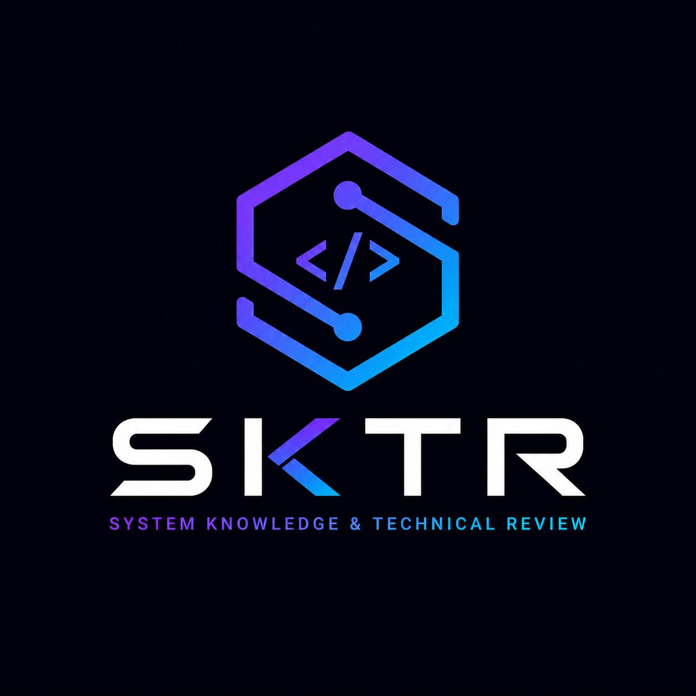

<p align="center">
  
</p>

# SKTR

**System Knowledge & Technical Review**

Understand your software before you change it.

> **Release candidate:** `1.0.0rc1` is the first public preview of the v1
> interface and artifact contract. Please report reproducible feedback through
> the [issue tracker](https://github.com/prubianes/sktr/issues).

SKTR is a language-agnostic software intelligence CLI. It turns Git changes into
a structured knowledge model, enriches that model with deterministic engineering
metrics, applies architecture rules, and produces review artifacts for people and
automation. Optional AI features explain the evidence; they do not replace it.

## What is SKTR?

Run `sktr review` inside a configured Git repository to answer practical review
questions:

- Which modules and public symbols changed?
- Did this change introduce new internal dependencies or dependency cycles?
- Which files and functions deserve attention first?
- Does the change violate a configured architecture boundary?
- What structured artifact can CI, reports, and future tooling consume?

The core is language-agnostic. Python, JavaScript/TypeScript, and Java analyzers,
rule packs, outputs, and AI providers are discovered as plugins through Python
entry points.

## Why SKTR?

Code review tools often begin with raw source and ask a model to discover what
matters. SKTR begins with deterministic facts. Git scope, symbols, dependencies,
metrics, rules, risk, and review priority are computed first. AI features receive
that structured context instead of the whole repository.

SKTR remains useful with AI disabled, produces stable output, and stores the
result as a versioned JSON artifact rather than only printing prose.

## Features

- Working-tree, branch, explicit-base, and commit review scopes
- Python analysis using the standard `ast` module
- JavaScript, JSX, TypeScript, TSX, and Java analysis using Tree-sitter
- Deterministic architecture and maintainability rules
- Configurable forbidden module dependencies and thresholds
- Knowledge enrichment with file, symbol, dependency, module, risk, and priority metrics
- Terminal, Markdown, JSON, and Mermaid output
- Plugin discovery and diagnostics
- CI severity gates, path exclusions, and parse diagnostics
- Optional OpenAI-powered explanations and recommendations

## Quickstart

SKTR requires Python 3.13 or newer and a Git repository. Install RC1 explicitly:

```bash
python -m pip install --pre sktr==1.0.0rc1
sktr --version
sktr --help
cd your-project
sktr init --yes
sktr review
```

Common next steps:

```bash
sktr review --ai
sktr review --ai --model gpt-5.6-terra
sktr review --format markdown --output REVIEW.md
sktr review --format json --output sktr-review.json
sktr graph --format mermaid --output architecture.mmd
sktr graph --scope repository --focus orders
```

See the [quickstart](docs/quickstart.md) for review scopes and a complete first run.
See [architecture graphs](docs/graphs.md) for repository and focused views.
See [analyzer semantics](docs/analyzers.md) for visibility, modules, and metrics.
See the [CLI reference](docs/cli.md) for every command and exit status.

## Example output

```text
SKTR Review

Summary
Risk: Medium
Score: 76/100
Changed files: 3
Issues: 2

Findings
High
! Forbidden dependency
  controllers/order_controller.py imports repositories/order_repository.py
  Reason: Controllers should access repositories through services.

Medium
! Large function detected
  create_order has 114 lines.

AI Review
Overview
The change crosses the controller-to-repository boundary and concentrates new
order behavior in one large function.
```

AI output appears only when enabled. Deterministic findings and scoring are the
same with or without AI.

## Configuration

`sktr init` creates `sktr.yml`. Use interactive setup to choose plugins, rules,
outputs, and optional AI features, or use `sktr init --yes` for safe defaults.

```yaml
project:
  name: sample-app
  default_base: main
review:
  default_scope: working_tree
  fail_on: null
  exclude:
    - node_modules/
    - .venv/
    - dist/
    - build/
    - target/
plugins:
  analyzers:
    - sktr-python
    - sktr-javascript-typescript
    - sktr-java
  rules:
    - sktr-rules-default
  outputs:
    - terminal
    - markdown
    - json
    - mermaid
rules:
  enabled:
    - new_dependency
    - large_file
    - large_function
    - forbidden_dependency
  large_file:
    max_changed_lines: 300
  large_function:
    max_lines: 80
  forbidden_dependencies:
    - source: controllers
      target: repositories
      reason: Controllers should access repositories through services.
ai:
  enabled: false
```

API keys never belong in this file. See the complete
[configuration reference](docs/configuration.md).

### Risk score

The score starts at 100. Deterministic findings subtract severity-weighted
penalties, with caps for repeated findings and categories. A separate bounded
review-breadth penalty accounts for production files, changed modules, public API
changes, and unusually large diffs. Documentation and test files are reported but
do not count as production files. Informational findings do not lower the score.

- Low: 85-100
- Medium: 65-84
- High: 40-64
- Critical: 0-39

## AI features

AI is optional. SKTR can ask a configured provider to explain deterministic
findings and recommend focused next steps using structured SKTR context.

```bash
export SKTR_OPENAI_API_KEY="your-api-key"
sktr ai doctor
sktr review --ai
```

OpenAI key resolution is `SKTR_OPENAI_API_KEY` first, then `OPENAI_API_KEY`.
SKTR never stores or prints the key. See [AI setup](docs/ai.md).

## Plugins

SKTR discovers analyzers, rule packs, outputs, and AI providers from these entry
point groups:

- `sktr.analyzers`
- `sktr.rules`
- `sktr.outputs`
- `sktr.ai_providers`

```bash
sktr plugins list
sktr plugins doctor
```

See the [plugin guide](docs/plugins.md) to build or distribute a plugin.

## Roadmap

SKTR 1.0 packages the deterministic review, three bundled analyzers, stable JSON
artifact, architecture graphing, CI gates, and optional AI Review developed
through v0.20. Post-v1 work remains tracked in the canonical roadmap.

The v0.16-v0.18 roadmap delivered bundled JavaScript/TypeScript and Java
analyzers, followed by CI severity gates, exclusions, parse diagnostics, and a
frozen artifact schema. v0.19 added repository-context graphs, and v0.20 added
evidence-based API exposure, logical application modules, alias resolution, and
more precise React and Java signals.
See the [canonical roadmap](docs/roadmap.md) for milestone deliverables and
deferred post-v1 work.

## Contributing

Development uses `uv`:

```bash
uv sync
uv run pytest
uv run sktr review
```

Read [CONTRIBUTING.md](CONTRIBUTING.md) and
[development.md](docs/development.md) before adding an analyzer, rule, output,
or provider. Release work is tracked in the
[v1.0.0rc1 checklist](docs/release-checklist.md).

For help, see [troubleshooting](docs/troubleshooting.md) and the
[known limitations](docs/limitations.md). Report sensitive vulnerabilities
privately according to [SECURITY.md](SECURITY.md). Release history is recorded in
the [changelog](CHANGELOG.md).

## License

SKTR is available under the [MIT License](LICENSE).
